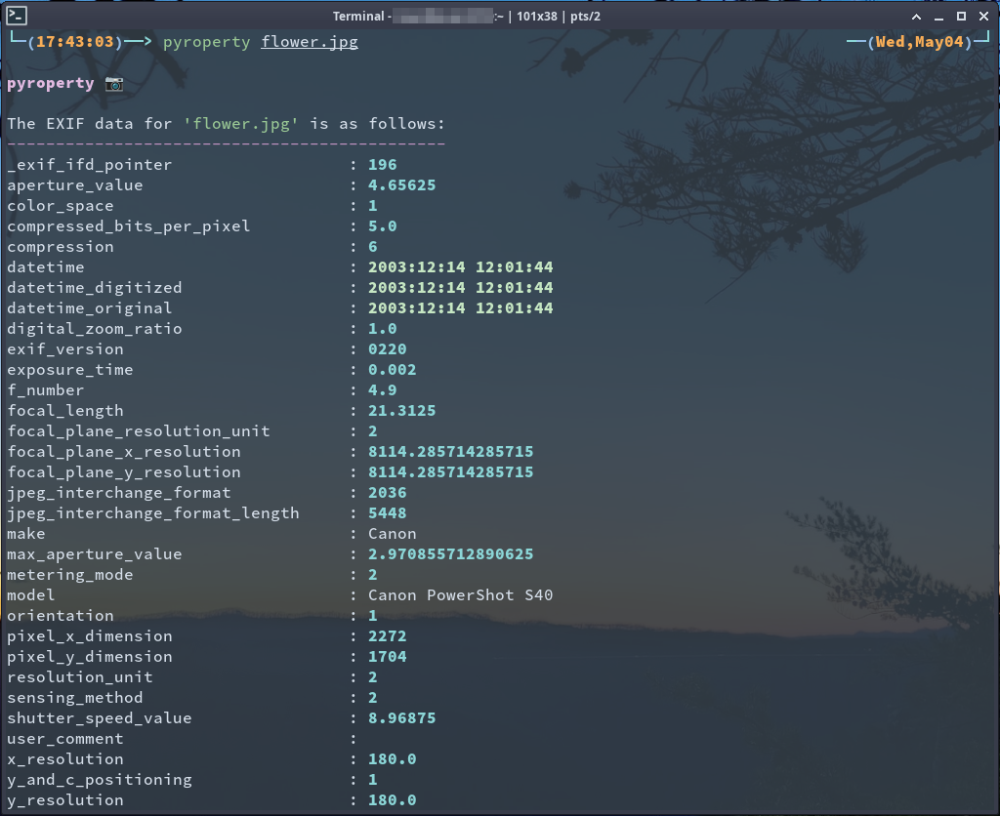

```
              .---.
 pyroperty    |[X]| 
 _.==._______.""""".
d __ ___.-''-. _____b
|[__]  /."""".\ _   |
|     // /""\ \\_)  |
|     \\ \__/ //    |
|      \`.__.'/     |
\=======`-..-'======/
 `-----------------'  
```

# pyroperty
The CLI tool to view the EXIF data of JPEGs

## Installation
```bash
git clone https://github.com/johnnyjoxenfree/pyroperty.git
```
or download the `.zip` file, go to the download directory then run `install.sh`
```bash
bash install.sh
```

## Example
